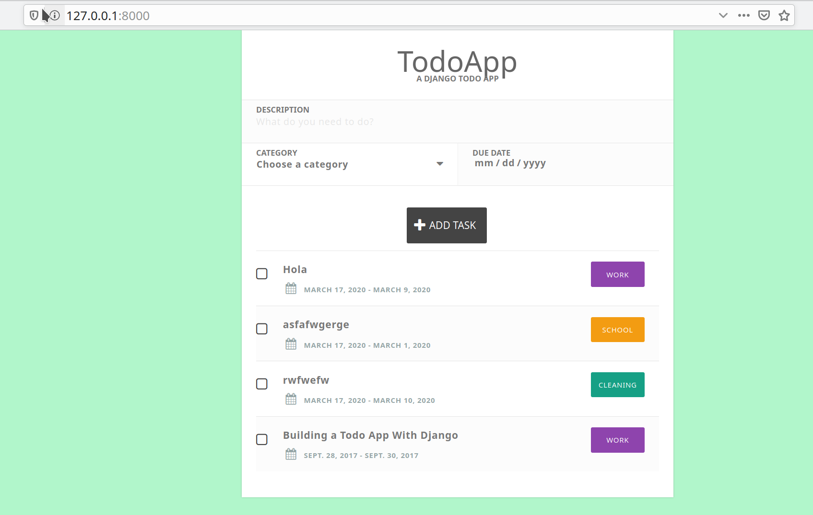
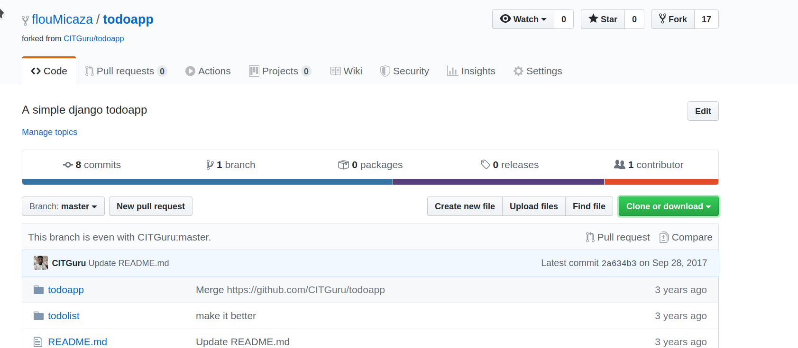
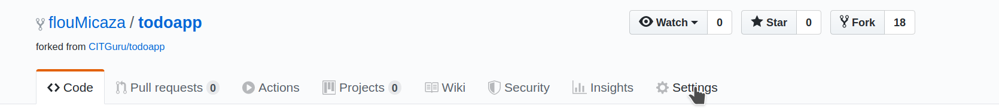
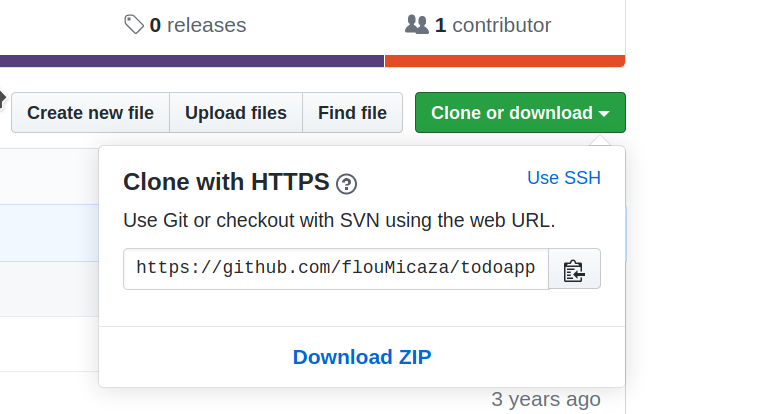
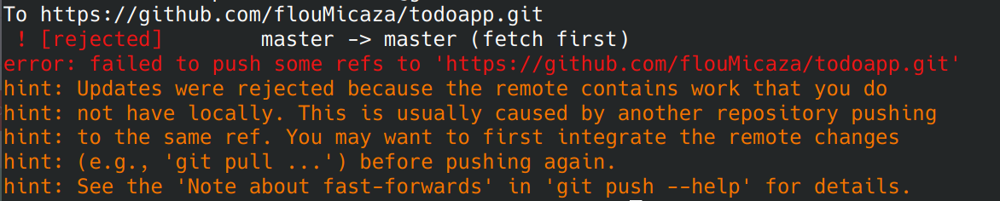
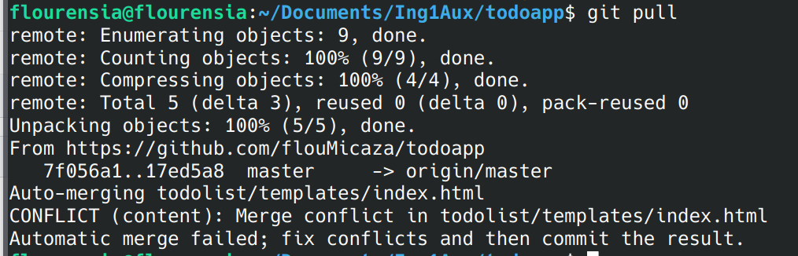

# Auxiliar 1 Ingenería de Software
Git es un software que permite hacer control de versiones de nuestros proyectos. 
En esta actividad vamos a aprender conceptos de control de versiones con Git, simulando un flujo de trabajo de desarrollo de software (simplificado). 

Esta es una app simple hecha en Django sacada de https://Github.com/CITGuru/todoapp. 
La app es una TODO list donde pueden agregar tareas, ponerles categoría y fecha de término. 
La versión de este repositorio no tiene la opción de eliminar una tarea, por lo tanto trabajarán en parejas para agregar esta funcionalidad. 



_Al final del README están las instrucciones de como correr el proyecto. Se recomienda seguir los pasos y cuando te digamos, recién correr la app._ 
>Para usar git necesitarán una consola que tenga git. En Windows pueden descargar git bash y en linux y mac pueden instalar git directo en la terminal. 

> Para editar los archivos pueden usar su editor de texto favorito. Algunos recomendados son [Sublime](https://www.sublimetext.com/3), [VS code](https://code.visualstudio.com/), [Pycharm](https://www.jetbrains.com/pycharm/) o [Notepad ++](https://notepad-plus-plus.org/). Varios de estos traen opciones para usar git desde el mismo editor y evitarse usar la consola. 
> Para esta actividad les recomendamos escribir los comandos y seguir todos los pasos para entender la base de git y luego en el proyecto pueden decidir si usar la consola o una interfaz. 
>  
## Actividad 

### [Parte 1: Fork del proyecto]
Hoy trabajarán todxs sobre el mismo código base, pero deberán hacer una copia de este código en su repositorio personal, para que los cambios no afecten a otras parejas. 

Para esto **UNA persona** de la pareja deberá hacer un "Fork" de este repositorio. 
1. En Github deben hacer click arriba a la derecha donde dice Fork y seguir las instrucciones. 


    Al hacer Fork deberían tener un repo como el de la imagen y en vez de llamarse _flouMicaza/todoapp_ debería decir _nombreusuario/todoapp_.

    Desde ahora los cambios que hagan en el nuevo repositorio no afectarán el repositorio de sus compañerxs ni el repositorio original.

2. La persona que creó el repositorio deberá darle acceso a su pareja como colaborador. Para esto deberán ir a settings en la barra superior del repositorio (como en la imagen) 

    Luego ir a _manage access_ y seleccionar _Invite a collaborator_. Ahí se deberá ingresar la cuenta de github de la pareja y la pareja deberá aceptar la invitación por mail o a través del link de invitación. 
    
    > Es importante que todos los miembros del equipo sean colaboradores del repositorio, porque esto les da el poder de hacer modificaciones al proyecto. 
    Si un usuario no es colaborador del proyecto al querer hacer push saldría un error de autenticación. 
    Para proyectos abiertos en los que cualquier usuario puede colaborar existe una opción llamada "Pull request". 
    Esto permite que un usuario o usuaria que no es colaborador pueda sugerir un cambio y las personas que si son colaboradoras deciden si se agregan o no los cambios al proyecto. 
    Mas info: [¿Qué es un pull request?](http://aprendegit.com/que-es-un-pull-request/) 
                                                                                                                                                                                                                                                                                                                                                                                                                                                       
                                                                                                                                                                                                                                                                                                                                                                                                                                                     
### [Parte 2: Clonar el proyecto] 
Desde ahora en adelante la persona que hizo el Fork será _"Persona A"_ y la otra persona de la pareja será _"Persona B"_.
Para poder trabajar, cada unx deberá clonar el proyecto en su computador siguiendo los siguientes pasos: 
1. Copiar el enlace del repositorio donde dice "Clone or download" 
2. Clonar el repositorio en la consola de Git:  `git clone https://url...` (_Escoger https y no ssh_)
> Si quieren leer las diferencias entre clonar con SSH y HTTPS : [Protocolos de git](https://git-scm.com/book/en/v2/Git-on-the-Server-The-Protocols) , [Conectar Github por ssh](https://help.github.com/en/github/authenticating-to-github/connecting-to-github-with-ssh)

> La versión del proyecto que encontramos en github se llama repositorio __remoto__ y la versión que está en nuestro computador se llamará __local__. 

### [Parte 3: Editar el proyecto]
En este paso cada integrante del grupo hará un cambio en el proyecto, que no afectará el trabajo del otro y luego ambos descargarán los cambios. 
1. __Persona A__ editará el archivo __views.py__ de la carpeta __todolist__ agregando el siguiente código donde está indicado: 

    ```python
        if "taskDelete" in request.POST: #checking if there is a request to delete a todo
            checkedlist = request.POST["checkedbox"] #checked todos to be deleted
            for todo_id in checkedlist:
                todo = TodoList.objects.get(id=int(todo_id)) #getting todo id
                todo.delete() #deleting todo

   ```

2. __Persona A__ actualizará el repositorio remoto. Desde la consola de Git se deberá hacer push de los cambios que se hicieron. Los pasos para hacer push a un repositorio son los siguientes (deben estar dentro de la carpeta todoapp para que Git funcione): 
    + `git status` para ver qué cambios se hicieron.
    + `git add nombre-archivo` para agregar un archivo al commit. En este caso el archivo será todolist/views.py 
    + `git commit -m "descripción del cambio que se hizo" ` para hacer commit de los cambios. 
    + `git push` para subir los cambios al repositorio remoto.  
    
3. __Persona B__ editará el archivo __index.html__ de la carpeta __todolist/templates__ agregando el siguiente código: 
   ```html
       <button class="taskDelete" name="taskDelete" formnovalidate="" type="submit" onclick="$('input#sublist').click();"><i class="fa fa-trash-o icon"></i>Delete Tasks</button>
   ```
    
4. __Persona B__ actualizará el repositorio remoto según las instrucciones del paso 2. Al hacer `git push` probablemente aparecerá el siguiente error: 


    Esto pasa porque __Persona A__ hizo cambios en un archivo y __Persona B__ no ha descargado estos cambios.
                                                                                                                                                                                                   
    Para arreglar esto __Persona B__ deberá descargar los cambios haciendo `git pull` .  Al hacer pull se tendrá que juntar (_merge_) la versión del repositorio con la versión local, es por esto que te aparecerá un editor con un mensaje parecido a este: 
    
    
    Se debe salir de ahí siguiendo las instrucciones de la consola y __Persona B__ ya tendrá los cambios remotos en su computador. 
    >Si no hay instrucciones para salir de ahí, probablemente estás usando VIM. Prueba escribiendo :wq y Enter, si no te resulta llama a la auxiliar. 
    
    __Persona B__ deberá hacer `git push` denuevo para que sus cambios queden en el repositorio remoto. 
    
5. __Persona A__ hace `git pull` en la consola de Git y podrá ver los cambios hechos por __Persona B__ sin problemas. 

>Generalmente para evitar tener problemas al hacer push de los cambios, se recomienda hacer `git pull` antes de hacer los pasos del punto 2.
Así te aseguras de arreglar cualquier error que pueda producirse entre el código remoto y tus cambios locales antes de crear el commit. 

### [Parte 4: Editar el mismo archivo]
Al final del README están las instrucciones de cómo correr la app en local. Se recomienda que ambas personas sigan estos pasos para asegurarse que la app funciona, antes de seguir. 

Hasta ahora tenemos una TODO list en la que podemos agregar y eliminar tareas. 

¿Qué pasa si ahora __Persona B__ quiere quitarle el subtítulo que dice "A DJANGO TODO APP" y __Persona A__ decide modificar el subtítulo sin avisar? 

1. __Persona B__ quitará el subtítulo que aparece en la app eliminando la siguiente línea del archivo __index.html__ de la carpeta __todolist/templates__: 
   ```html
      <p class="tagline">a Django todo app</p>
   ```
2. __Persona B__ actualizará el repositorio remoto según las instrucciones del punto 2, Parte 3. 

3. __Persona A__ (_SIN DESCARGAR LOS CAMBIOS DE LA OTRA PERSONA_) editará la siguiente linea del archivo __index.html__ de la carpeta __todolist/templates__: 
    ```html
      <p class="tagline">a Django todo app</p>
   ``` 
   modificando donde dice "a Django todo app" por otro texto. 

4. __Persona A__ actualizará el repositorio remoto según las instrucciones del punto 2, Parte 3. 
Al hacer `git push ` __Persona A__ verá que hay un conflicto como pasó en la parte anterior. 

    Para resolver esto se debe hacer `git pull` y aparecerá este mensaje: 
     

    Esto pasa cuando dos personas editan en mismo archivo del proyecto. Muchas veces Git puede solucionar estos conflictos automáticamente, pero otras veces la persona que desarrolla tendrá que decidir cuál será el código definitivo. 

5. __Persona A__ verá que su archivo __index.html__ está modificado y le agregaron algunas líneas: 
    
    Lo primero que se ve es  
    ```html 
       <<<<<<< HEAD 
            <codigo local>
        >>>>>>>> 
   ```
   HEAD representa la punta de la rama en la que se está trabajando. En este caso como ya se creó el commit, HEAD será la versión del código que __Persona A__ editó recién. El código que aparecerá en esta parte será, entonces, la versión del código __en conflicto__ de la rama local. 
   
   Luego veremos lo siguiente: 
   ```html 
        <codigo remoto>
   >>>>>>> 17ed5a8a2f2b44e4daf2302d63f6a6b8163xxxxx
   ```
   Por lo tanto el código que aparecerá ahí será la versión del código de la rama remota. En este caso sería el código que subió __Persona B__.
   El número largo que aparecerá es el identificador del último commit remoto. 
   
   > Git hace esto para mostrarnos las dos versiones del código y que la persona que esté desarrollando pueda decidir cuál será la versión definitiva. 
   Hay que tener cuidado al hacer este procedimiento porque podríamos eliminar trabajo de otras personas. 
   
6. __Persona A__ decidirá que quiere dejar su versión y no la de su pareja, por lo que eliminará todo el código que Git agregó incluyendo los símbolos <, HEAD e identificadores de commit. 
Viendo los códigos del punto 5 debería quedar solo `<codigo local>`. 
  
7. Finalmente __Persona A__ deberá subir el resultado del merge. Para eso se debe: 
    + Volver a agregar los archivos modificados durante el merge haciendo `git add todolist/templates/index.html` 
    + `git commit` para hacer commit del merge. Aquí no es necesario poner -m y un mensaje porque se está haciendo merge. 
    + `git push` para terminar de subir los cambios locales y el arreglo de los conflictos. 
    
Si revisan los commits en github verán que se crearon dos commits. Un commit por hacer merge de la rama remota y la local, y otro commit que representa los cambios que hizo __Persona A__. 
> Lo bueno de esto que es que si hay problemas al momento de resolver los conflictos, se podrá volver a una versión anterior del código. 

### Más información sobre Git
En esta actividad vimos una manera muy simplificada de usar git, que será suficiente para el proyecto del curso. 
En proyectos mas grandes donde se tienen varias versiones del proyecto, un servidor con una versión oficial, un servidor con pruebas y mucha gente trabajando, el uso de git se vuelve mas complejo. 
Para solucionar esto hay varias estrategias en las que se usan las [ramas de git o "branches"](https://git-scm.com/book/en/v2/Git-Branching-Basic-Branching-and-Merging) para dividir las diferentes versiones del código y el trabajo en progreso. 
Una de estas estrategias es git flow y podrás encontrar más información [aquí](http://aprendegit.com/que-es-git-flow/).
Muchas veces las empresas y organizaciones definen su propio flujo según la forma en que están organizadas, pero guiándose por git flow.  

## ¿Cómo ejecuto la app en mi computador? 
Sigue los siguientes pasos en orden y deberías tener una todolist corriendo en tu localhost. 
Estas instrucciones están hechas para correr el proyecto desde la consola, una vez que ya lo clonaste. 

__No importa que no entiendas los pasos, aprenderemos como funciona Django en otra clase auxiliar__ 
1. Desde la consola entra a la carpeta del proyecto todoapp. Deberías ver algo como esto: `user@pc:~/ruta/al/repo/Auxiliar1-GIT$ `
2. Deberás crear un ambiente virtual para correr el proyecto. Al trabajar con proyectos de python es importante tener siempre ambientes virtuales. 
Para crear el ambiente virtual sigue [estas instrucciones](https://tutorial.djangogirls.org/es/django_installation/). 
Atención que en este caso el proyecto ya trae un archivo requirements.txt por lo que debes saltarte el paso de escribir tus propios requirements y solo ejecutar `pip install -r requirements.txt`.
 
3. Ejecuta `python manage.py migrate` para actualizar la base de datos. 
4. Ejecuta `python manage.py runserver` para correr un servidor en tu computador. 
5. En tu navegador ingresa a _127.0.0.1:8000_ y verás tu app funcionando. 
